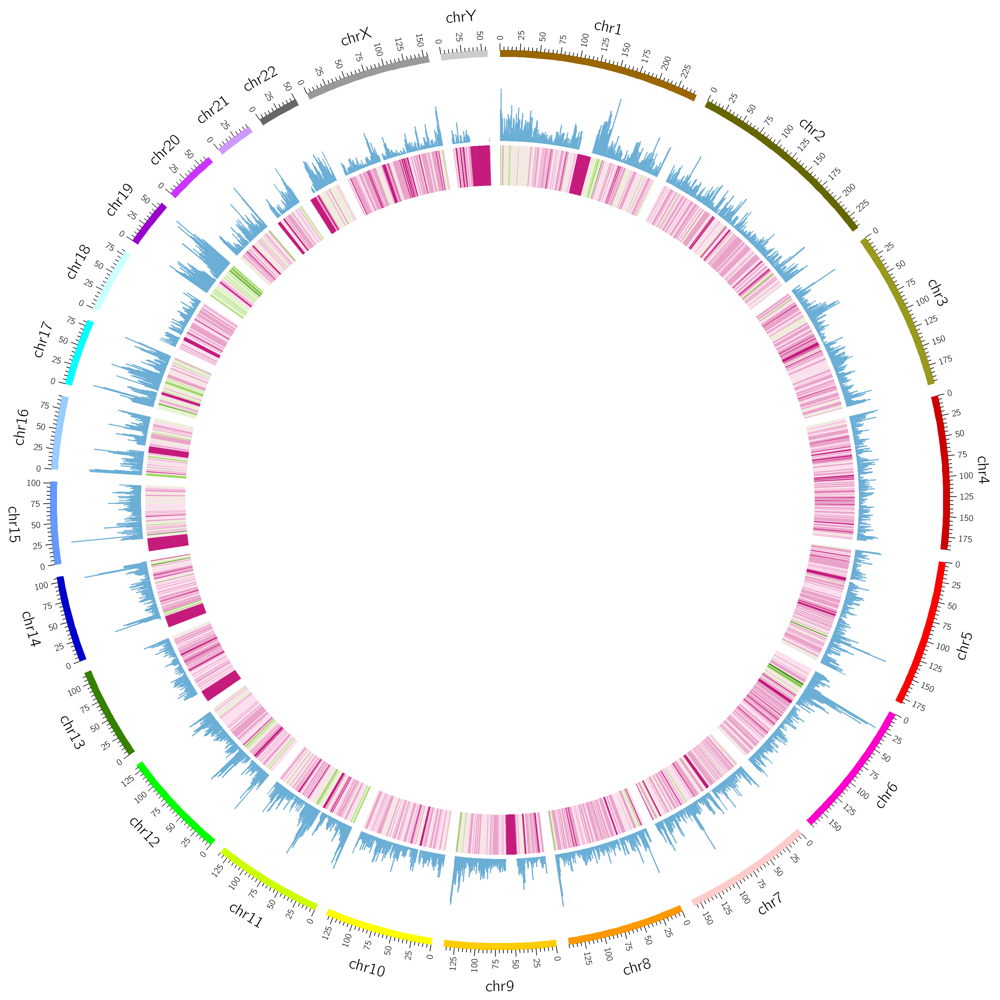

### Here are my test files for the circos software
#### Firstlu, we need to install the circos software. we can install the circos by conda or download the binary file, and then we can download the tutorial files to learn how to plot the figures that we want from the following links:
- [circos-tutorials-0.67.zip](https://circos.ca/software/download/)

#### I ploted the heatmap and histgram of the data using circos software. 
```shell
circos -conf circos_label.conf
```
- 

#### We can chose the color schemes from **etc/colors** folder or refer to the following sites:
- [Brewer palettes](https://mk.bcgsc.ca/brewer/)

# circos_plot
